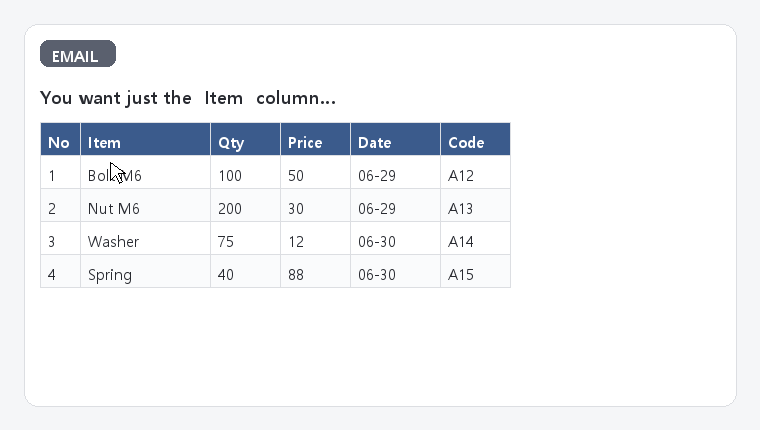
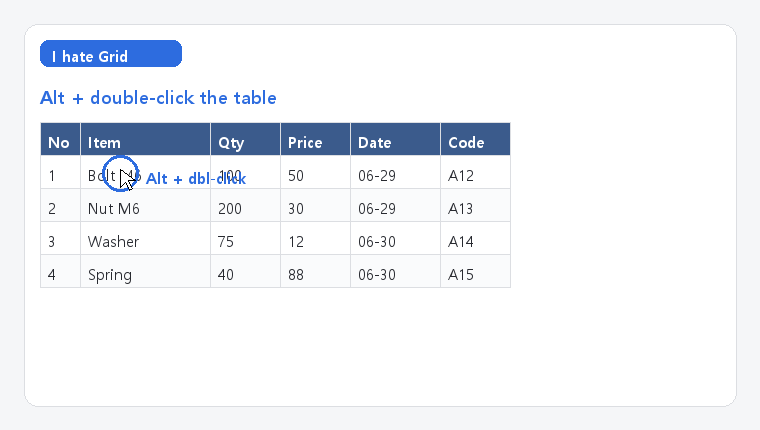

# I hate Grid 😈

> **That one annoying table. Grabbed in two clicks.**
> No more retyping cells. No more "paste → fix every column" ritual. Just grab the table and go.

You know the ritual. An email shows up with a beautiful table — a ledger, a SAP
export, a list of vendors. You drag to select it, you paste it, and… it explodes
into one sad linear smear of text. Columns? Gone. Rows? A rumor. Your soul? Crushed.

I made this freeware out of pure workplace spite. **I hate Grid** lets you yank any
on-screen table into a real, Excel-style grid you can actually select columns from.

**Alt + double-click a table → it pops up as a grid → grab the columns you want → paste into Excel.** Done. 😈

## The pain → the cure

**Before** — you want just the *Item* column, but the drag grabs **B C D E F G** and the paste comes out as one smeared line:



**After** — Alt + double-click, pick the one column you want, paste clean:



## The trick: it reads text, not pixels

Most "screen table" tools screenshot the area and run OCR — which cheerfully turns
`aaa1325235` into `aa-1325235` and calls it a day. We refuse.

**I hate Grid reads the *real* characters the app already knows about**, via Windows
UI Automation. So `aaa1325235` stays `aaa1325235`. No OCR, no guessing, no garbage.

Two ways in:

| Move | What happens |
|------|--------------|
| **Alt + double-click** a cell | reads the whole table it belongs to — exact text |
| **Select the table + Ctrl+C** | a little 😈 pops up; click it to grab the table from the clipboard (works in web mail, Word, browsers — anything that copies) |

Then: click a column header to select the whole column, drag the cells you want,
**Ctrl+C**, and paste straight into Excel/Sheets. Double-click a cell to fix anything by hand.

> Some apps (Chrome/Edge/Electron, in-browser PDFs) keep their accessibility tree
> switched off for speed, so Alt+double-click can't see their text. For those, just
> **select + Ctrl+C** — the clipboard still has the real thing.

## Run it

**Grab the `.exe`** from [Releases](../../releases) — no install, just double-click. A
neon… ahem, a tidy tray icon appears and you're ready.

Or run from source:

```bash
pip install -r requirements.txt
python -m ihategrid
```

- Windows 10 / 11
- Python 3.10+ (only if running from source)

## Under the hood

| File | Job |
|------|-----|
| `main.py` | tray app, the global Alt+double-click hook (on its own thread so Windows can't kill it), the clipboard watcher, wiring |
| `uia_table.py` | UI Automation: point → the real table text |
| `reconstruct.py` | turns positioned text boxes into clean rows & columns |
| `grid_window.py` | the frameless grid; column selection; copy-as-TSV |
| `html_tables.py` | parse a copied HTML table from the clipboard |

A couple of things I learned the hard way and left comments about:
a low-level mouse hook on the GUI thread gets silently killed when the UI stalls
(so it lives on its own thread), and UI Automation is COM-based — spin up a new
thread per call and the *second* call mysteriously dies (so it runs on one
long-lived thread). Both bugs presented as "works once, then never again." Fun.

## "Convenience always wins."

Free forever. Fork it, ship it, and spread it far and wide. 🚀

© 2026 Tailgatelab · MIT License
